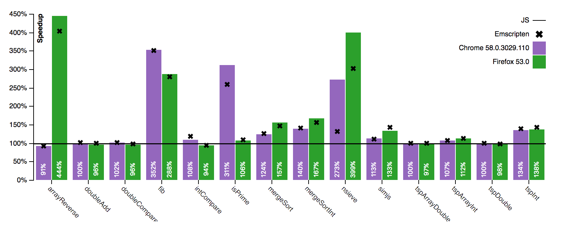

# Speedy.js

[](https://badge.fury.io/js/speedyjs-compiler)
[](https://travis-ci.org/MichaReiser/speedy.js) [](https://codeclimate.com/github/MichaReiser/speedy.js)
<a href="https://codeclimate.com/github/MichaReiser/speedy.js/coverage"></a>

Speedy.js is a compiler for a well considered, performance pitfalls free [subset of JavaScript](https://github.com/MichaReiser/speedy.js/wiki/Language-Reference) targeting WebAssembly. Because WebAssembly is statically-typed, the project uses TypeScript as type-checker and to resolve the types of the program symbols. 

The project is very experimental and still far away from being production ready. 
 
## Prerequisites 

1. A lot of disk space (~20gb)
2. A lot of ram (~4gb)
3. A lot of patience
4. Up to date C++ compiler, and other build essentials (see [LLVM requirements](http://llvm.org/docs/GettingStarted.html#requirements))

These requirements will change as soon as the WebAssembly backend for LLVM is no longer experimental and 
included in your platforms build by default.

There is also a pre-build [Ubuntu VM](https://drive.switch.ch/index.php/s/vpjsvWfVPnJHp9k) (user: speedyjs, password: welcome) that can be used to experiment with the compiler. You find the [Speedy.js Playground project](https://github.com/MichaReiser/speedy.js-playground) in the users home directory.

## Getting Started

### Setup LLVM
First, you need an LLVM installation that includes the experimental WebAssembly target. You can test if your LLVM installation includes the WebAssembly backend by running

```bash
llvm-config --targets-built
```

If the output contains the word *WebAssembly* you are good to go (continue with *Install Cross Compiler*). If not, then you have to build LLVM from source by following [these instructions](./doc/BUILD_LLVM_FROM_SOURCE.md).

After LLVM has been built and is installed, set the path to the `llvm-config` executable (it is located in the installation directory) using `npm config set` or an `.npmrc` file in your project:

```bash
npm config set LLVM_CONFIG /llvm/install/dir/llvm-config
```

or when using the `.npmrc` file:

```ini
LLVM_CONFIG = "/llvm/install/dir/llvm-config"
```

### Install Cross Compiler

Now the compiler can be installed using `npm install` (or yarn or whatever). Also install the custom TypeScript version that has support for the `int` base type.

 
```bash
npm install --save-dev speedyjs-compiler MichaReiser/TypeScript#2.3.3-with-int
```

## Compile your first Script
You have to mark Speedy.js functions with the `use speedyjs` directive. Furthermore, you have to declare Speedy.js functions that are called from a pure JavaScript function as `async` (see `fib`). 

fib.ts:

```typescript
async function fib(value: int): Promise<int> {
    "use speedyjs";

    return fibSync(value);
}

function fibSync(value: int): int {
    "use speedyjs";

    if (value <= 2) {
        return 1;
    }

    return fibSync(value - 2) + fibSync(value - 1);
}

async function main() {
    console.log(await fib(40));
}
```

The compiler will compile the `fib` and `fibSync` function to WebAssembly whereas the `main` function remains in pure JS. 

The script can be compiled using:

```
$(npm bin)/speedyjs fib.ts
```

which outputs the `fib.js` file. 

To compile all files in the current directory omit any file names or pass multiple file names to the CLI. More details about how to use the CLI is documented in [the wiki](https://github.com/MichaReiser/speedy.js/wiki/CLI).

## WebPack Loader

The package `loader` contains a WebPack loader implementation. See the packages [README](./packages/loader/README.md) for more details.

## Benchmark


## Setup the Development Environment

Clone the git repository:

```
git clone --recursive https://github.com/MichaReiser/speedy.js.git
```

Ensure that LLVM is set up (see Getting Started).

Run the `install` and `bootstrap` scripts in the just cloned directory:

```
npm install
npm run bootstrap
```
